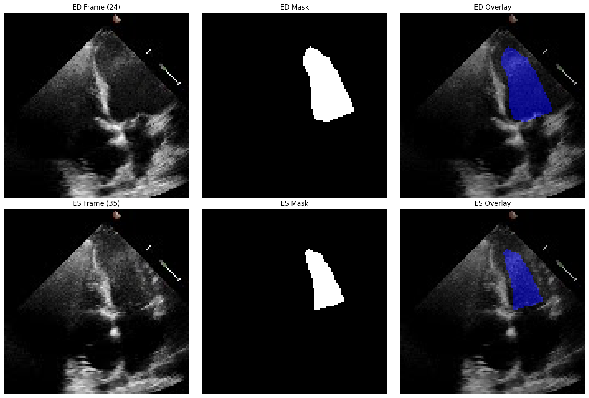

# EchoFrame: Lightweight and Accurate LVEF Estimation with Heartbeat Analysis
**Author:** Harshal Chalke  
**Course:** Capstone Project  
**Dataset:** [EchoNet-Dynamic by Stanford AIMI](https://stanfordaimi.azurewebsites.net/datasets/834e1cd1-92f7-4268-9daa-d359198b310a)


---

<div align="center">
  
</div>

## Overview
EchoFrame aims to achieve precise **left ventricle segmentation** using one of the candidate models, enabling **accurate estimation of Left Ventricular Ejection Fraction (LVEF)** through End-Systolic Volume (ESV) and End-Diastolic Volume (EDV). The goal is to develop a lightweight, efficient, and scalable framework, offering a cost-effective, reliable solution for **cardiac function assessment in resource-constrained settings**. Further extending the application for **video segmentation** using the high-quality annotations from the current SOTA model called SimLVseg. This will enable us for processing of **volumetric heart signals**. 

---

## Project Framework

<div align="center">
  
</div>


The experimental setup involves a two-stage framework for cardiac function assessment using echocardiogram videos. In Stage 1, **MobileNetV3** is trained on annotated **ED and ES frames** from EchoNet Train Set 1, while **SimLVSeg** generates **dense annotations** for EchoNet Train Set 2 to fine-tune a **pretrained MobileNetV3** for full-frame segmentation. In Stage 2, these segmentations are used for **volume estimation** via geometric formulas to calculate **EDV and ESV**, enabling **LVEF estimation** and **heartbeat signal analysis** for accurate and efficient cardiac evaluation.

---
## Core Algorithm


### 🔹 Architecture Diagram

<div align="center">

</div>

### 🔹 Layer-wise Parameter Table

| **Component**                      | **Type**                               | **Parameters**     |
|-----------------------------------|----------------------------------------|--------------------|
| **Encoder (MobileNetV3-Large)**   |                                        |                    |
| Initial Conv + BN + Hardswish     | Conv2d block                           | 464                |
| Inverted Residual Blocks (x16)    | Depthwise + SE + Pointwise             | ~5.86M             |
| Squeeze-and-Excitation Units (x8) | AdaptiveAvgPool + FC layers            | Included above     |
| Final Conv Layer                  | Conv2d-BN-Activation                    | 24,000             |
| **Decoder (UNet-style)**          |                                        |                    |
| Upsample Block 1                  | Upsample + Conv-BN-ReLU ×2             | 183,680            |
| Upsample Block 2                  | Upsample + Conv-BN-ReLU ×2             | 8,672              |
| Upsample Block 3                  | Upsample + Conv-BN-ReLU ×2             | 8,096              |
| Upsample Block 4                  | Upsample + Conv-BN-ReLU ×2             | 6,944              |
| Final Upsampling Layer            | Bilinear Upsample                      | 0                  |
| Segmentation Head                 | 1×1 Conv                               | 17                 |
|                                   | **Total Parameters**                   | **6,151,545**      |


---
## Training Results

| **Model**               |           **Performance**                           |
|------------------|--------------------------------------------|
| **Baseline 1**   |   |
| **Baseline 2**   |  |
| **Core Model**   |    |


---

##  Results & Baseline Comparison

| **Model**                                     | **DSC ↑** | **LVEF MAE ↓** | **Params (M) ↓** | **FLOPs (G) ↓** |
|----------------------------------------------|-----------|----------------|------------------|-----------------|
| [EchoNet-Dynamic (Ouyang et al.) [1]](./papers/echonet_dynamic.pdf)     | 0.89      | **4.10**       | 21.30            | 17.60           |
| [EchoCoTr (Muhtaseb et al.) [2]](./papers/echocotr.pdf)                 | 0.92      | 3.95           | –                | 19.61           |
| [SimLVSeg-SI [3]](./papers/simlvseg.pdf)                                | 0.9331    | –              | 24.83            | 2.17            |
| [**SimLVSeg-3D [3]**](./papers/simlvseg.pdf)                            | **0.9332**| –              | 18.83            | 1.13            |
| [MU-Net [4]](./papers/mobile_unet.pdf)                                  | 0.905     | 6.61           | 12.38            | 2.06            |
| [MU-Net + MaskTrack [4]](./papers/mobile_unet.pdf)                      | 0.850     | 8.24           | –                | –               |
| [Mobile U-Net (Muldoon et al.) [4]](./papers/mobile_unet.pdf)          | 0.90      | –              | 7.50             | 5.20            |
| UNet                                         | 0.9269    | 7.018          | 91.90            | 30.95           |
| UNetR                                        | 0.9108    | 7.923          | 31.00            | 20.98           |
| **Ours (MobileNetV3 U-Net)**                 | **0.9270**| **6.749**      | **6.15**         | **0.39**        |


---

## Directory Structure
```bash
echoframe_capstone/
├── assets/      # Project figures and visualizations
├── data/        # Sample data or placeholder path for dataset
├── src/         # Core source code
│   ├── dataloader.py
│   ├── train.py
│   ├── model1.py        # Baseline model
│   ├── model3.py        # Alternative encoder
│   ├── model6.py        # Final model (MobileNetV3-Unet)
│   └── utils.py
├── results/     # Evaluation outputs and visualizations
├── README.md
└── requirements.txt
```

---

## Installation Instructions

1. **Clone the Repository**
    ```bash
    git clone https://github.com/harshalchalke31/echoframe_capstone.git
    cd echoframe_capstone
    ```

2. **Set up the Environment**
    ```bash
    virtualenv echoframe
    ./echoframe/Scripts/activate
    pip install -r requirements.txt
    ```
    Or use conda:
    ```bash
    conda create -n echoframe python=3.8
    conda activate echoframe
    pip install -r requirements.txt
    ```

---

## Data Preparation
1. Download the [**EchoNet-Dynamic**](https://stanfordaimi.azurewebsites.net/datasets/834e1cd1-92f7-4268-9daa-d359198b310a) dataset.
2. Extract into a folder named `data/` within the root directory.
3. Ensure structure resembles:
    ```
    data/
    ├── EchoNet_Dynamic/
    │   ├── Videos/
    │   └── FileList.csv
    │   └── VolumeTracings.csv
    ```

---

## Run Instructions

After data preparation, open `main.ipynb`, update the `data_path` variable as per your system, uncomment the training code, and run the entire notebook.

---

## Inference / Evaluation

For evaluation, open `test.ipynb`, update the `data_path` variable accordingly, and run the notebook to evaluate the model on the test set.

## Acknowledgments

- **Dataset:** [EchoNet-Dynamic](https://echonet.github.io/dynamic/) by Stanford Center for Artificial Intelligence in Medicine & Imaging (AIMI).
- **Model Architectures:** Base U-Net and MobileNetV3 encoders adapted from publicly available open-source repositories cited within the source code.
- **Benchmarking:** Special thanks to the [EchoNet GitHub repository](https://github.com/echonet/dynamic) for providing evaluation protocols and baseline benchmarks.

## References

[1] Ouyang, D., He, B., Ghorbani, A., et al. (2020). *Video-based AI for beat-to-beat assessment of cardiac function*. Nature, 580, 252–256. [`PDF`](./papers/echonet_dynamic.pdf)

[2] Muhtaseb, R., & Yaqub, M. (2022). *EchoCoTr: Estimation of the left ventricular ejection fraction from spatiotemporal echocardiography*. In MICCAI. [`PDF`](./papers/echocotr.pdf)

[3] Maani, F., Ukaye, A., Saadi, N., et al. (2023). *SimLVSeg: Simplifying Left Ventricular Segmentation in 2D+Time Echocardiograms*. arXiv:2310.00454. [`PDF`](./papers/simlvseg.pdf)

[4] Muldoon, M., & Khan, N. (2023). *Lightweight and interpretable left ventricular ejection fraction estimation using mobile U-Net*. arXiv:2304.07951. [`PDF`](./papers/mobile_unet.pdf)

## License

This project is licensed under the **MIT License**.  
For more details, refer to the [LICENSE](LICENSE) file in the repository.

