# EchoFrame: Lightweight and Accurate LVEF Estimation with Heartbeat Analysis
**Author:** Harshal Chalke  
**Course:** IDAI 780 Capstone, IMGS 789 Project  
**Dataset:** [EchoNet-Dynamic by Stanford AIMI](https://stanfordaimi.azurewebsites.net/datasets/834e1cd1-92f7-4268-9daa-d359198b310a)


---

<div align="center">
  <div style="display: flex; justify-content: center; gap: 20px;">
    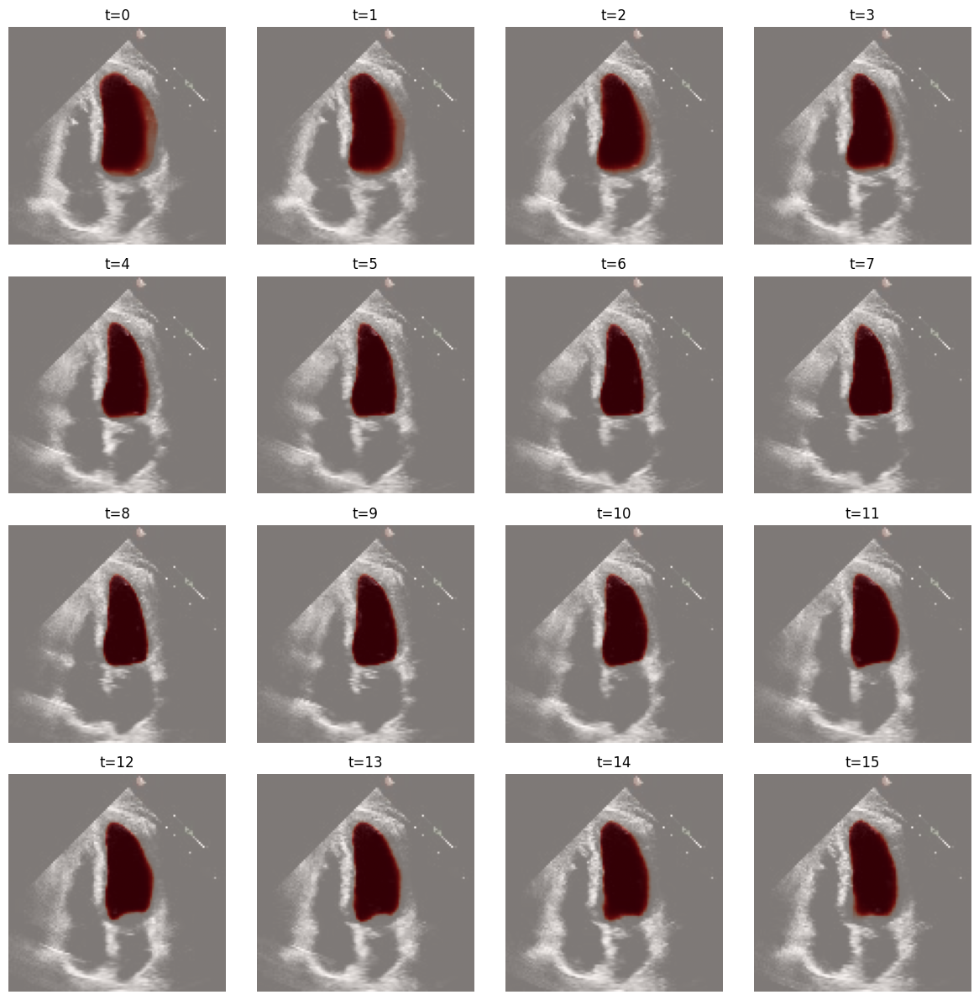
    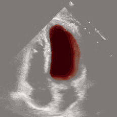
  </div>
  <p><em>Figure 1: Segmented left ventricle outputs obtained from 3D MobileNetV3 after self-supervised pretraining using a vanilla autoencoder.</em></p>
</div>


## Overview
EchoFrame aims to achieve precise **left ventricle segmentation** using one of the candidate models, enabling **accurate estimation of Left Ventricular Ejection Fraction (LVEF)** through End-Systolic Volume (ESV) and End-Diastolic Volume (EDV). The goal is to develop a lightweight, efficient, and scalable framework, offering a cost-effective, reliable solution for **cardiac function assessment in resource-constrained settings**. Further extending the application for **video segmentation** using the high-quality annotations from the current SOTA model called SimLVseg. This will enable us for processing of **volumetric heart signals**. 

---

## Project Framework

<div align="center">
  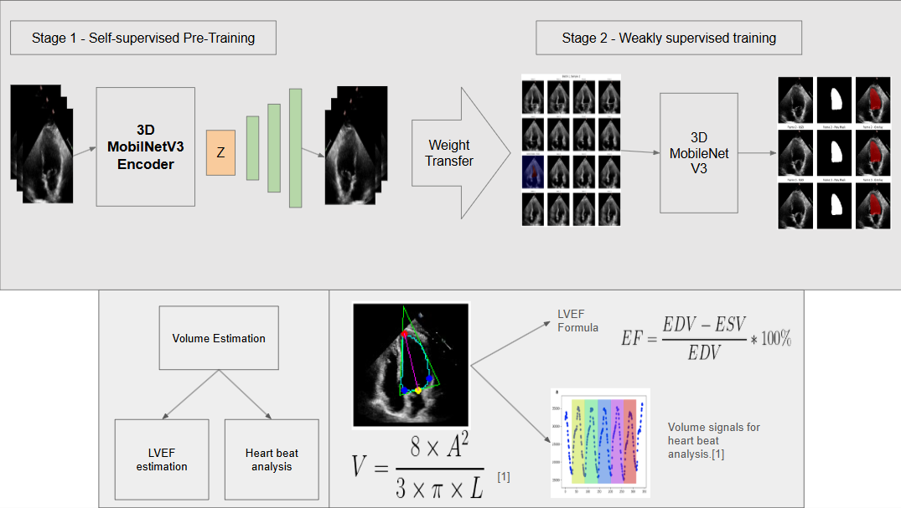
  <p><em>Figure 2: Two stage framework for training a 3D MobileNetV3 Unet from scratch, and pipeline for volume estimation.</em></p>
</div>


The experimental setup involves a two-stage framework for cardiac function assessment using echocardiogram videos. In Stage 1, Self-Supervised pretraining of **3D MobileNetV3 Encoder** to reconstruct echocardiograms in an Autoencoder setting. In Stage 2, this pretrained encoder is used in a weakly supervised setting (with annotations only at the center frame) to localize and segment LV regions by penalizing center frame incorporating temporal consistency; these segmentations are then used for **volume estimation** via Simpson's monoplane approximation to calculate **EDV and ESV**, enabling **LVEF estimation** and **heartbeat signal analysis** for accurate and efficient cardiac evaluation.

---
## Core Algorithm


### 🔹 3D MobileNetV3 Encoder + UNet Decoder

<div align="center">
  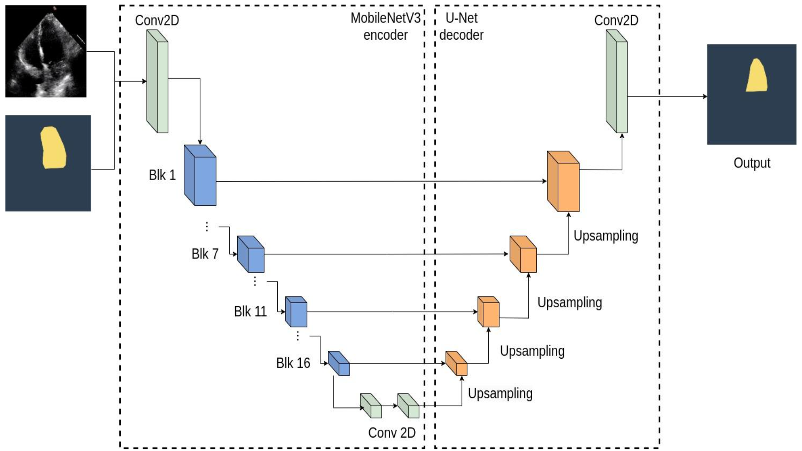
  <p><em>Figure 3: The 2D MobileNetV3 + UNet decoder architecture, which served as the foundational inspiration for the proposed 3D MobileNetV3 encoder and UNet decoder design..</em></p>
</div>


### Component-wise Summary of 3D MobileNetV3-UNet Architecture

| **Component**                     | **Type**                              | **Parameters** |
|----------------------------------|---------------------------------------|----------------|
| **Encoder (MobileNetV3-Large 3D)** |                                       |                |
| Initial Conv + BN + Hardswish    | Conv3d block                          | 1,296          |
| Inverted Residual Blocks (x16+)  | Depthwise + SE + Pointwise            | ~5.5M          |
| SE Units (x6+)                   | AdaptiveAvgPool + FC layers           | Included above |
| Final Conv Layers                | Conv3d-BN-Activation                  | 230,400        |
| **Decoder (UNet-style 3D)**       |                                       |                |
| Decoder Block 1                  | ConvTranspose + Conv-BN-ReLU + Residual | 1,434,496   |
| Decoder Block 2                  | ConvTranspose + Conv-BN-ReLU + Residual | 1,035,680   |
| Decoder Block 3                  | ConvTranspose + Conv-BN-ReLU + Residual | 458,720     |
| Decoder Block 4                  | ConvTranspose + Conv-BN-ReLU + Residual | 154,464     |
| Decoder Block 5                  | ConvTranspose + Conv-BN-ReLU          | 15,442         |
| Segmentation Head                | 1x1 Conv                              | 34             |
| **Total Parameters**             |                                       | **5,706,786**  |

---
## Stage 1 - Self-Supervised Pretraining Results

| **Mode**                     | **Loss Curves**                                              | **Test Results**                                      | **Reconstructed Frame**                                  |
|-----------------------------|--------------------------------------------------------------|-------------------------------------------------------|-----------------------------------------------------------|
| **Vanilla Autoencoder**     | 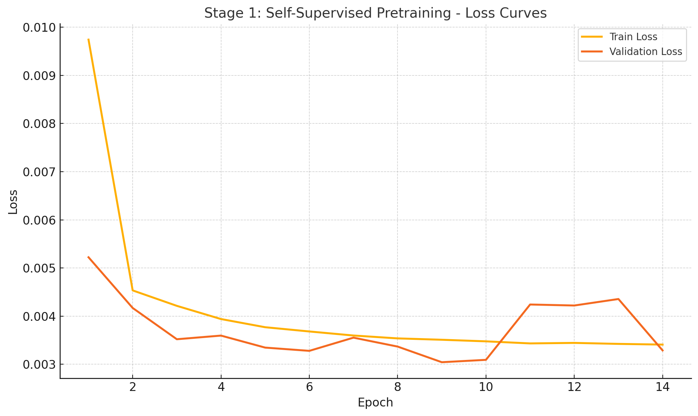 | PSNR: 25.20 dB<br>SSIM: 0.7488<br>TDC: 0.003219       | 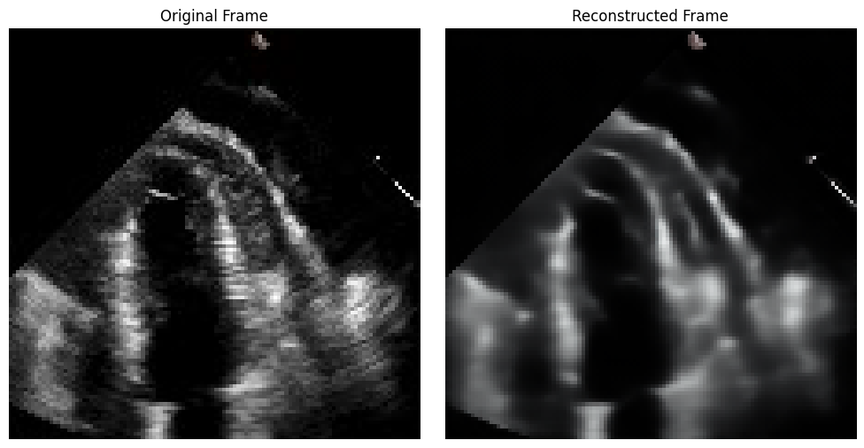 |
| **Masked Autoencoder** (ratio = 0.75) | 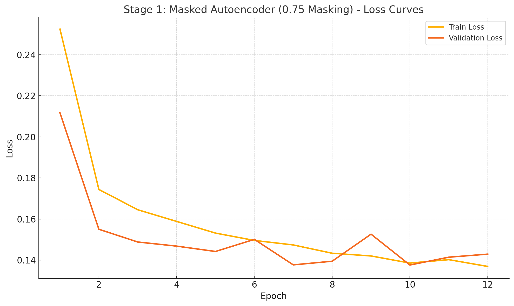 | PSNR: 23.05 dB<br>SSIM: 0.6389<br>TDC: 0.003286       | 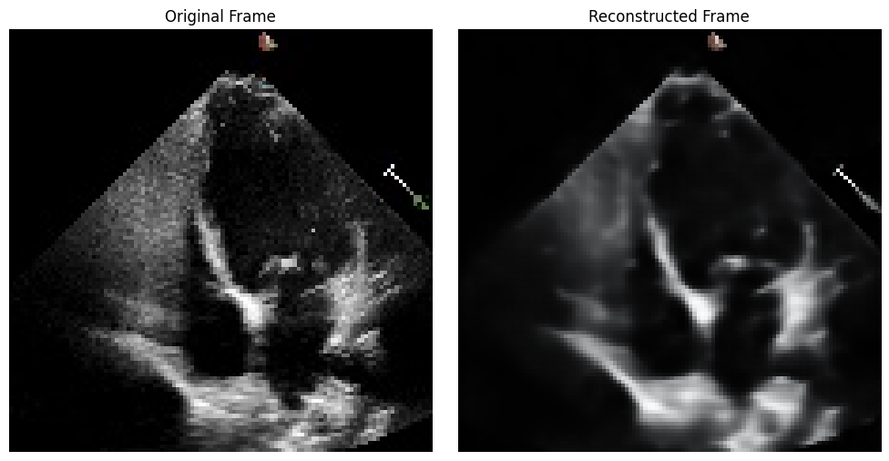 |


---
## Stage 2 - Weakly-Supervised Training

<!-- 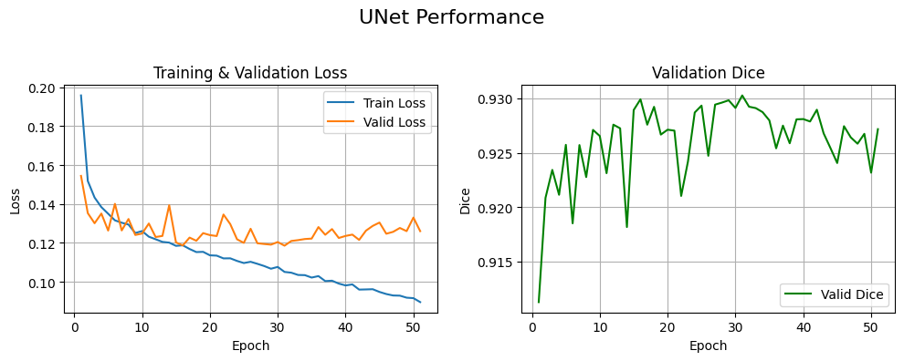 -->
<!-- 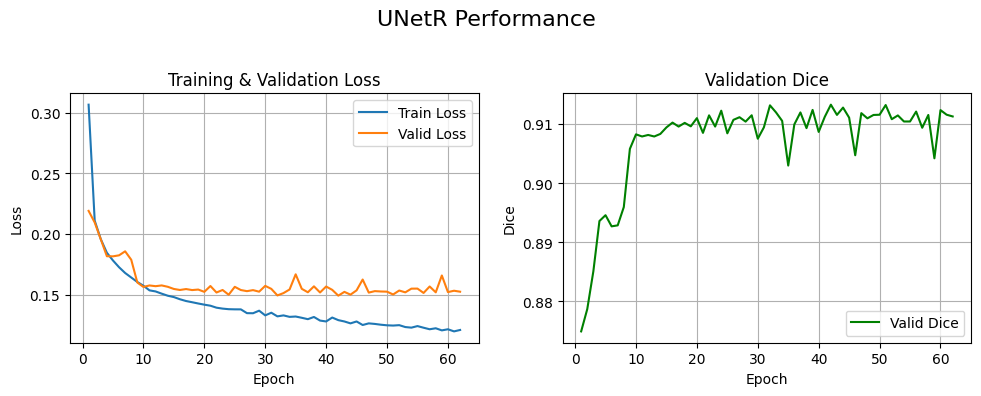 -->
| **Model**               |           **Performance**                           |
|------------------|--------------------------------------------|
| **2D MobileNetV3 UNet** (Baseline 3)   | 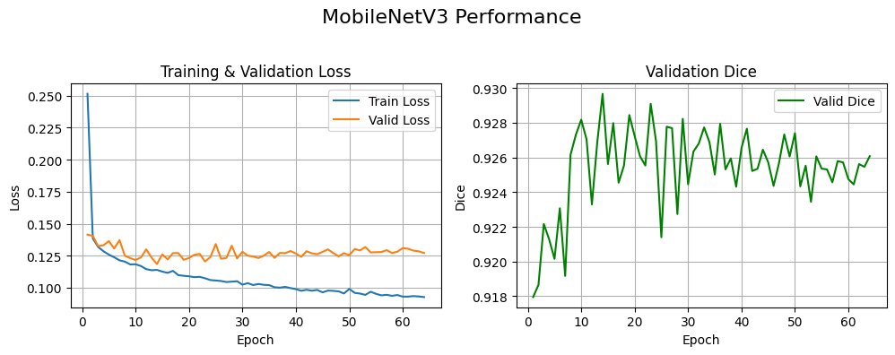  |
| **3D MobileNetV3 UNet 1** (pretrained - vanilla autoencoder)   | 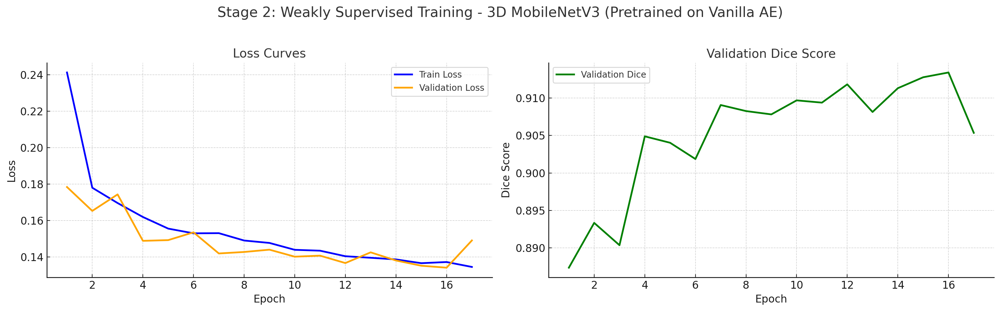 |
| **3D MobileNetV3 UNet** (pretrained - masked autoencoder)   |  **Model Running**  |
| **3D MobileNetV3 UNet** (from Scratch)   |  **Model Running**  |


---

##  Results & Baseline Comparison

| **Model**                                     | **DSC ↑** | **LVEF MAE ↓** | **Params (M) ↓** | **FLOPs (G) ↓** |
|----------------------------------------------|-----------|----------------|------------------|-----------------|
| [EchoNet-Dynamic (Ouyang et al.) [1]](./papers/echonet_dynamic.pdf)     | 0.89      | **4.10**       | 21.30            | 17.60           |
| [EchoCoTr (Muhtaseb et al.) [2]](./papers/echocotr.pdf)                 | 0.92      | 3.95           | –                | 19.61           |
| [SimLVSeg-SI [3]](./papers/simlvseg.pdf)                                | 0.9331    | –              | 24.83            | 2.17            |
| [**SimLVSeg-3D [3]**](./papers/simlvseg.pdf)                            | **0.9332**| –              | 18.83            | 1.13            |
| [MU-Net [4]](./papers/mobile_unet.pdf)                                  | 0.905     | 6.61           | 12.38            | 2.06            |
| [MU-Net + MaskTrack [4]](./papers/mobile_unet.pdf)                      | 0.850     | 8.24           | –                | –               |
| [Mobile U-Net (Muldoon et al.) [4]](./papers/mobile_unet.pdf)          | 0.90      | –              | 7.50             | 5.20            |
| UNet (Baseline 1)                                        | 0.9269    | 7.018          | 91.90            | 30.95           |
| UNetR (Baseline 2)                                       | 0.9108    | 7.923          | 31.00            | 20.98           |
| 2D MobileNetV3 U-Net (Baseline 3)                 | 0.9270 | **6.749**      | 6.15         | **0.39**        |
| **3D MobileNetV3 U-Net** (pretrained - vanilla autoencoder)                 | **0.9137** | --      | **5.70**         | 38.76        |
| **3D MobileNetV3 U-Net** (pretrained - masked autoencoder)                 | -- | --      | **5.70**         | 38.76        |
| **3D MobileNetV3 U-Net** (from scratch)                 | -- | --      | **5.70**         | 38.76        |


---
## Directory Structure
```bash
echoframe_capstone/
├── assets/      # Project figures and visualizations
├── data/        # Sample data or placeholder path for dataset
├── src/         # Core source code
│   ├── dataloader.py
│   ├── train.py
│   ├── model1.py        # Baseline model
│   ├── model3.py        # Alternative encoder
│   ├── model6.py        # Final model (MobileNetV3-Unet)
│   └── utils.py
├── results/     # Evaluation outputs and visualizations
├── README.md
└── requirements.txt
```

---

## Installation Instructions

1. **Clone the Repository**
    ```bash
    git clone https://github.com/harshalchalke31/echoframe_capstone.git
    cd echoframe_capstone
    ```

2. **Set up the Environment**
    ```bash
    virtualenv echoframe
    ./echoframe/Scripts/activate
    pip install -r requirements.txt
    ```
    Or use conda:
    ```bash
    conda create -n echoframe python=3.8
    conda activate echoframe
    pip install -r requirements.txt
    ```

---

## Data Preparation
1. Download the [**EchoNet-Dynamic**](https://stanfordaimi.azurewebsites.net/datasets/834e1cd1-92f7-4268-9daa-d359198b310a) dataset.
2. Extract into a folder named `data/` within the root directory.
3. Ensure structure resembles:
    ```
    data/
    ├── EchoNet_Dynamic/
    │   ├── Videos/
    │   └── FileList.csv
    │   └── VolumeTracings.csv
    ```

---

## Run Instructions

After data preparation, open `main.ipynb`, update the `data_path` variable as per your system, uncomment the training code, and run the entire notebook.

---

## Inference / Evaluation

For evaluation, open `test.ipynb`, update the `data_path` variable accordingly, and run the notebook to evaluate the model on the test set.

## Acknowledgments

- **Dataset:** [EchoNet-Dynamic](https://echonet.github.io/dynamic/) by Stanford Center for Artificial Intelligence in Medicine & Imaging (AIMI).
- **Model Architectures:** Base U-Net and MobileNetV3 encoders adapted from publicly available open-source repositories cited within the source code.
- **Benchmarking:** Special thanks to the [EchoNet GitHub repository](https://github.com/echonet/dynamic) for providing evaluation protocols and baseline benchmarks.

## References

[1] Ouyang, D., He, B., Ghorbani, A., et al. (2020). *Video-based AI for beat-to-beat assessment of cardiac function*. Nature, 580, 252–256. [`PDF`](./papers/echonet_dynamic.pdf)

[2] Muhtaseb, R., & Yaqub, M. (2022). *EchoCoTr: Estimation of the left ventricular ejection fraction from spatiotemporal echocardiography*. In MICCAI. [`PDF`](./papers/echocotr.pdf)

[3] Maani, F., Ukaye, A., Saadi, N., et al. (2023). *SimLVSeg: Simplifying Left Ventricular Segmentation in 2D+Time Echocardiograms*. arXiv:2310.00454. [`PDF`](./papers/simlvseg.pdf)

[4] Muldoon, M., & Khan, N. (2023). *Lightweight and interpretable left ventricular ejection fraction estimation using mobile U-Net*. arXiv:2304.07951. [`PDF`](./papers/mobile_unet.pdf)

## License

This project is licensed under the **MIT License**.  
For more details, refer to the [LICENSE](LICENSE) file in the repository.

