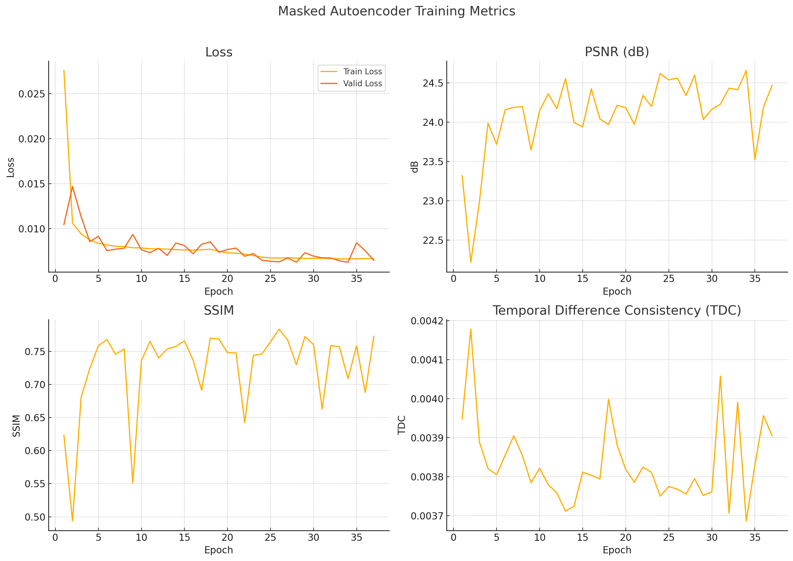

## Masked Autoencoder Metrics
<div align="center">
  
</div>


## 🧠 What is Temporal Consistency?

**Temporal Consistency** measures how smoothly **visual content changes over time**, especially across **consecutive frames** in a video.

It answers:
> “Does the model maintain **stable and coherent motion patterns** over time?”

---

## 🧪 How Are We Measuring It?

You’re currently using the **Temporal Difference Consistency (TDC)** metric, defined as:

```python
TDC = MSE(Δoutput_t, Δinput_t)
```

Where:
- `Δoutput_t = output[:, :, t+1] - output[:, :, t]`
- `Δinput_t = input[:, :, t+1] - input[:, :, t]`

This compares the **temporal gradients** of the model’s output to those of the ground truth.

✅ Low TDC = **smooth, consistent motion**  
❌ High TDC = **flickering, jumpy transitions**

---

## 📐 What Is It Measured On?

| Axis | Meaning |
|------|--------|
| **Input video frames** | The raw temporal differences (e.g., subtle heart motion in EchoNet) |
| **Output reconstructions** | Your autoencoder’s temporal behavior |
| **MSE over time axis** | Measures consistency frame-to-frame in output **vs** input |

---

## 🎯 Benchmarks & Expected Values

There is **no universal benchmark** like SSIM > 0.8 or PSNR > 25 dB — because **TDC is custom and context-specific**, but here's a rough guide for EchoNet-style data:

| TDC Value      | Temporal Quality           |
|----------------|----------------------------|
| `< 0.0035`     | 🔥 Excellent temporal smoothness (rare) |
| `0.0035–0.004` | ✅ Very good — low flicker, consistent motion |
| `0.004–0.005`  | ⚠️ Acceptable but some artifacts may exist |
| `> 0.005`      | ❌ Likely visible flicker or erratic changes |

---

## 📈 Other Common Metrics (Alternatives)

| Metric | Description | Usage |
|--------|-------------|-------|
| **Warping Error** | Compare optical flow–warped previous frame to current | More accurate, but needs optical flow |
| **Flow Consistency** | Use pretrained optical flow model to assess temporal discrepancy | Heavier, more robust |
| **LPIPS Temporal** | Perceptual diff over time | Used in GANs and diffusion papers |
| **FVD** (Fréchet Video Distance) | Learned metric like FID but for video | Used in generative video synthesis |

---

## ✅ Why TDC is a Smart Choice

- Lightweight, self-supervised
- No need for external flow models
- Trivially implementable in PyTorch
- Intuitive: “Does motion match?”

